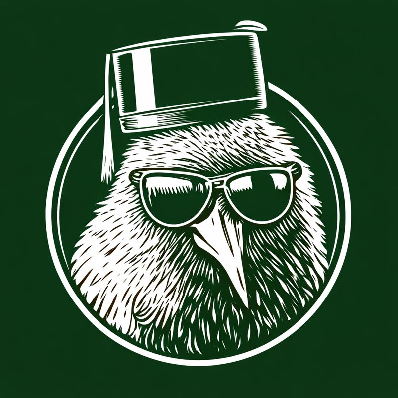
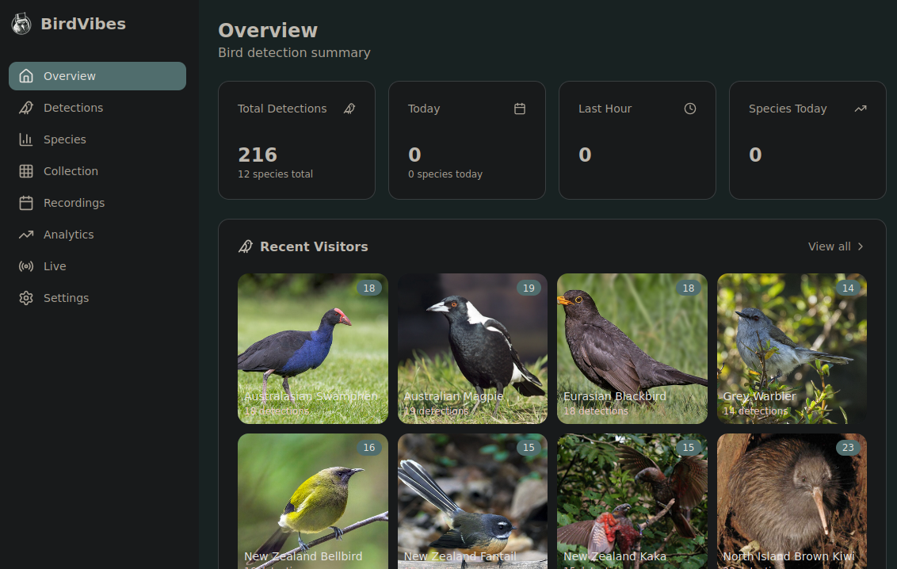
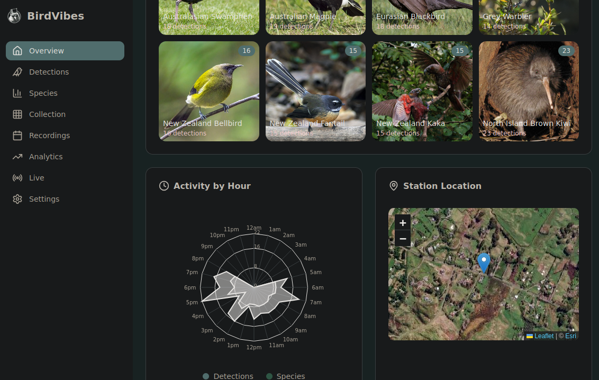
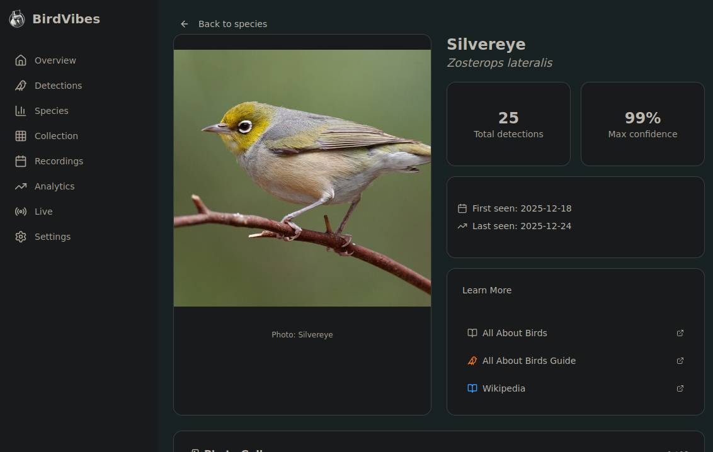
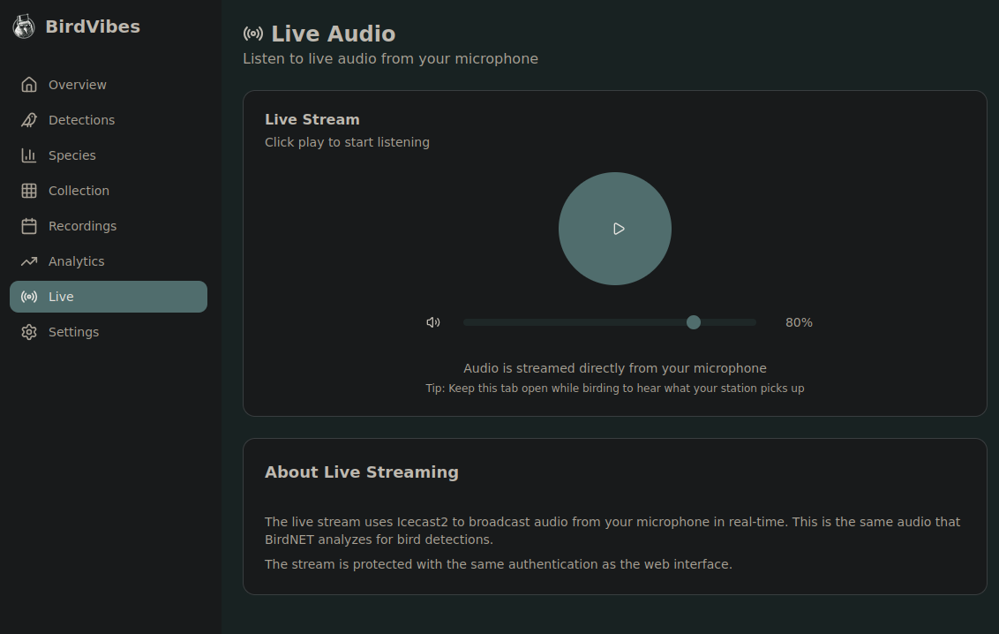

<p align="center">
  
</p>
<h1 align="center">
  BirdVibes
</h1>
<p align="center">
A modern web interface for real-time acoustic bird classification on Raspberry Pi
</p>

## About

BirdVibes is a modern React-based web interface for BirdNET-Pi, providing an enhanced user experience for monitoring and exploring bird detections. Built on top of the excellent [BirdNET-Pi](https://github.com/mcguirepr89/BirdNET-Pi) project and [Nachtzuster's fork](https://github.com/Nachtzuster/BirdNET-Pi).

### New Features

- **Modern React UI** - Fast, responsive single-page application
- **Species Collection** - Pokedex-style collection with rarity badges
- **eBird Integration** - Regional species data, observations, hotspots, frequency heatmaps
- **BirdWeather Integration** - Station stats and community recordings
- **Live Audio Stream** - Listen to your microphone in real-time
- **Image Gallery** - Multiple image sources (Wikipedia, Flickr, Ornithophile)
- **Reference Calls** - Audio samples from Xeno-Canto
- **Analytics Dashboard** - Detection trends, hourly patterns, seasonal data
- **New Bird Notifications** - Get notified when new species are detected
- **External Links** - Quick access to eBird, All About Birds, Birds of the World

## Requirements

- Raspberry Pi 5, 4B, 400, 3B+, or 0W2
- 64-bit RaspiOS (Bookworm or Trixie recommended)
- USB Microphone or Sound Card
- Node.js 18+ (for frontend build)

## Installation

### Fresh Install

For a clean Raspberry Pi with no previous BirdNET-Pi installation:

```bash
curl -s https://raw.githubusercontent.com/SkylarCastator/BirdVibes/main/newinstaller.sh | bash
```

The installer will clone the repository to `~/BirdNET-Pi`, set up the Python environment, build the React frontend, and configure all services. The Pi will reboot automatically when finished.

### Upgrading from BirdNET-Pi

If you have an existing BirdNET-Pi installation (from [mcguirepr89](https://github.com/mcguirepr89/BirdNET-Pi) or [Nachtzuster](https://github.com/Nachtzuster/BirdNET-Pi)), you can upgrade in-place. Your detection data and configuration will be preserved.

**1. Point your repo to BirdVibes:**

```bash
cd ~/BirdNET-Pi
git remote set-url origin https://github.com/SkylarCastator/BirdVibes.git
git fetch origin
git reset --hard origin/main
```

**2. Run the update script:**

```bash
./scripts/update_birdnet.sh
```

This will pull the latest code, build the React frontend, and update your Caddy web server configuration to serve the new UI.

**3. Update the Caddy config** (if the new UI doesn't load after updating):

```bash
sudo ./scripts/update_caddyfile.sh
```

> **Note:** Node.js 18+ is required for the frontend build. If it's not installed, the update script will skip the frontend build and show instructions for installing Node.js.

### Uninstalling

To completely remove BirdVibes/BirdNET-Pi from your system:

**1. Run the uninstall script:**

```bash
~/BirdNET-Pi/scripts/uninstall.sh
```

This removes all systemd services, cron jobs, Icecast, Avahi aliases, symlinked scripts, and the `/etc/birdnet/` configuration directory.

**2. Remove the installation directory:**

```bash
rm -rf ~/BirdNET-Pi
```

**3. Optionally remove the database and recordings:**

Your bird recordings and database are stored outside the install directory (location depends on your config in `/etc/birdnet/birdnet.conf`). Check `RECS_DIR` and `EXTRACTED` in your config if you want to remove those as well.

### Clean Reinstall

If you're having issues upgrading, you can do a clean reinstall while keeping your data:

**1. Back up your data:**

```bash
# Save your config and database
cp /etc/birdnet/birdnet.conf ~/birdnet.conf.backup
cp ~/BirdNET-Pi/scripts/birds.db ~/birds.db.backup
```

**2. Uninstall and remove the old installation:**

```bash
~/BirdNET-Pi/scripts/uninstall.sh
rm -rf ~/BirdNET-Pi
```

**3. Run a fresh install:**

```bash
curl -s https://raw.githubusercontent.com/SkylarCastator/BirdVibes/main/newinstaller.sh | bash
```

**4. Restore your data after the install completes and the Pi reboots:**

```bash
sudo cp ~/birdnet.conf.backup /etc/birdnet/birdnet.conf
cp ~/birds.db.backup ~/BirdNET-Pi/scripts/birds.db
sudo systemctl restart caddy
```

## Building the Frontend

The frontend is built with React, TypeScript, and Vite.

```bash
cd frontend

# Install dependencies
npm install

# Development server (with hot reload)
npm run dev

# Production build
npm run build
```

The production build outputs to `frontend/dist/` which is served by the PHP router.

## Development Setup

### Prerequisites

- PHP 8.x with SQLite support
- Node.js 18+
- npm or yarn

### Running Locally

1. Start the PHP backend:
```bash
php -S 0.0.0.0:8080 router.php
```

2. Start the frontend dev server:
```bash
cd frontend
npm run dev
```

3. Access at http://localhost:5173

### Project Structure

```
BirdVibes/
├── frontend/           # React frontend (Vite + TypeScript)
│   ├── src/
│   │   ├── components/ # UI components
│   │   ├── pages/      # Page components
│   │   ├── hooks/      # React hooks
│   │   └── lib/        # Utilities and API
│   └── dist/           # Production build output
├── scripts/            # Backend PHP scripts and shell scripts
│   ├── api.php         # REST API endpoints
│   ├── ebird_api.php   # eBird integration
│   └── common.php      # Shared utilities
└── model/              # BirdNET model files
```

## API Configuration

Configure these in Settings or `/etc/birdnet/birdnet.conf`:

| Setting | Description | Required |
|---------|-------------|----------|
| LATITUDE | Your location latitude | Yes |
| LONGITUDE | Your location longitude | Yes |
| EBIRD_API_KEY | eBird API key for regional data | Recommended |
| BIRDWEATHER_TOKEN | BirdWeather station token | Optional |
| IMAGE_PROVIDER | WIKIPEDIA or FLICKR | Optional |

### Getting API Keys

- **eBird**: [ebird.org/api/keygen](https://ebird.org/api/keygen) (free)
- **BirdWeather**: [app.birdweather.com](https://app.birdweather.com) (create account)

## Data Sources

BirdVibes integrates with multiple data sources:

- **eBird** - Regional species, observations, hotspots, frequency data
- **BirdWeather** - Station statistics, community recordings
- **All About Birds** - Species information and guides
- **Birds of the World** - Comprehensive species accounts (subscription)
- **Wikipedia/Wikimedia** - Bird images (free)
- **Flickr** - Creative Commons photos
- **Ornithophile** - Taxonomy, conservation status
- **Xeno-Canto** - Reference call recordings

## Updating

To update an existing BirdVibes installation to the latest version:

```bash
~/BirdNET-Pi/scripts/update_birdnet.sh
```

This pulls the latest code, rebuilds the React frontend, and applies any system-level changes. You can also specify a remote and branch:

```bash
# Update from a specific remote/branch
~/BirdNET-Pi/scripts/update_birdnet.sh -r origin -b main
```

## Attribution

BirdVibes is built upon the work of:

- **[BirdNET](https://github.com/kahst/BirdNET-Analyzer)** by [@kahst](https://github.com/kahst) - The core bird sound classification model
- **[BirdNET-Pi](https://github.com/mcguirepr89/BirdNET-Pi)** by [@mcguirepr89](https://github.com/mcguirepr89) - The original Raspberry Pi implementation
- **[Nachtzuster's Fork](https://github.com/Nachtzuster/BirdNET-Pi)** - Significant improvements and Bookworm support

## License

This project inherits the licensing from BirdNET-Pi. See [LICENSE](LICENSE) for details.

**Important**: BirdNET-Pi and its derivatives may not be used to develop commercial products.

## Contributing

Contributions are welcome! Please feel free to submit issues and pull requests.

## Screenshots





